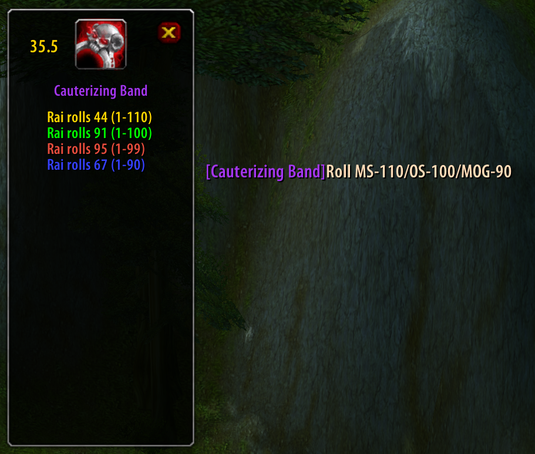

Loot Blare 1.1.2
===

A frame that pops up and shows item and rolls when a single uncommon+ item is linked in Raid Warning.  

Default frame duration to stay on screen without a new /roll occuring is `20 seconds`, change with:  
`/lootblare <number>`  
Make the frame appear to move it with:  
`/lootblare`
* All credit to Ehawn of `Weird Vibes`. Thanks for making this addon.
### The (moveable) frame in game:  
  

Small tweaks for the purposes of Farmers Market
* Larger window displays 20 rolls
* Sort rolls by the max roll
* Color code based on max roll
